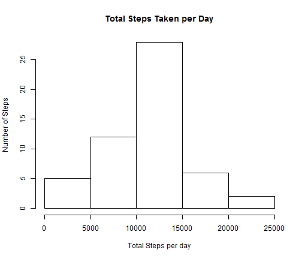
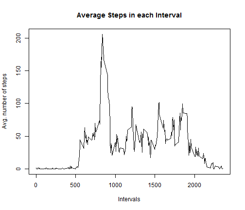
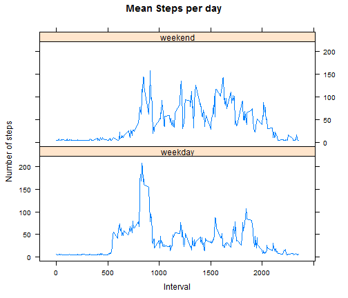

# Reproducible Research: Peer Assessment 1
Activity Monitoring Analysis
========================================================
This assignment makes use of data from a personal activity monitoring device. This device collects data at 5 minute intervals through out the day. The data consists of two months of data from an anonymous individual collected during the months of October and November, 2012 and include the number of steps taken in 5 minute intervals each day.

Dataset: Activity monitoring data [52K]
The variables included in this dataset are:

        steps: Number of steps taking in a 5-minute interval (missing values are coded as NA)
        
        date: The date on which the measurement was taken in YYYY-MM-DD format
        
        interval: Identifier for the 5-minute interval in which measurement was taken

The dataset is stored in a comma-separated-value (CSV) file and there are a total of 17,568 observations in this dataset.


## Loading and preprocessing the data
Read input file

```r
input <- read.csv("activity.csv")
#install.packages("dplyr")
```


## What is mean total number of steps taken per day?

Determine mean total number of steps taken per day
        Ignore rows with incomplete data
  1. Make a histogram of total number of steps taken per day

```r
        input <- input[complete.cases(input),]

                total_steps_daily <- by(input$steps,input$date,sum)
        
                hist(total_steps_daily, xlab = "Total Steps per day", ylab = "Number of Steps",
                        main = "Total Steps Taken per Day")
```

 


  2. Calculate mean and median total number of steps per day

```r
                library(dplyr)
```

```
## 
## Attaching package: 'dplyr'
## 
## The following objects are masked from 'package:stats':
## 
##     filter, lag
## 
## The following objects are masked from 'package:base':
## 
##     intersect, setdiff, setequal, union
```

```r
                a <- group_by(input,date)
                input_by_date <- summarize(a, mean_steps = mean(steps),
                                  median_steps = median(steps),
                                  n=n())
                                
                input_by_date
```

```
## Source: local data frame [53 x 4]
## 
##          date mean_steps median_steps   n
## 1  2012-10-02     0.4375            0 288
## 2  2012-10-03    39.4167            0 288
## 3  2012-10-04    42.0694            0 288
## 4  2012-10-05    46.1597            0 288
## 5  2012-10-06    53.5417            0 288
## 6  2012-10-07    38.2465            0 288
## 7  2012-10-09    44.4826            0 288
## 8  2012-10-10    34.3750            0 288
## 9  2012-10-11    35.7778            0 288
## 10 2012-10-12    60.3542            0 288
## 11 2012-10-13    43.1458            0 288
## 12 2012-10-14    52.4236            0 288
## 13 2012-10-15    35.2049            0 288
## 14 2012-10-16    52.3750            0 288
## 15 2012-10-17    46.7083            0 288
## 16 2012-10-18    34.9167            0 288
## 17 2012-10-19    41.0729            0 288
## 18 2012-10-20    36.0938            0 288
## 19 2012-10-21    30.6285            0 288
## 20 2012-10-22    46.7361            0 288
## 21 2012-10-23    30.9653            0 288
## 22 2012-10-24    29.0104            0 288
## 23 2012-10-25     8.6528            0 288
## 24 2012-10-26    23.5347            0 288
## 25 2012-10-27    35.1354            0 288
## 26 2012-10-28    39.7847            0 288
## 27 2012-10-29    17.4236            0 288
## 28 2012-10-30    34.0938            0 288
## 29 2012-10-31    53.5208            0 288
## 30 2012-11-02    36.8056            0 288
## 31 2012-11-03    36.7049            0 288
## 32 2012-11-05    36.2465            0 288
## 33 2012-11-06    28.9375            0 288
## 34 2012-11-07    44.7326            0 288
## 35 2012-11-08    11.1771            0 288
## 36 2012-11-11    43.7778            0 288
## 37 2012-11-12    37.3785            0 288
## 38 2012-11-13    25.4722            0 288
## 39 2012-11-15     0.1424            0 288
## 40 2012-11-16    18.8924            0 288
## 41 2012-11-17    49.7882            0 288
## 42 2012-11-18    52.4653            0 288
## 43 2012-11-19    30.6979            0 288
## 44 2012-11-20    15.5278            0 288
## 45 2012-11-21    44.3993            0 288
## 46 2012-11-22    70.9271            0 288
## 47 2012-11-23    73.5903            0 288
## 48 2012-11-24    50.2708            0 288
## 49 2012-11-25    41.0903            0 288
## 50 2012-11-26    38.7569            0 288
## 51 2012-11-27    47.3819            0 288
## 52 2012-11-28    35.3576            0 288
## 53 2012-11-29    24.4688            0 288
```


## What is the average daily activity pattern?


#What is the Average Daily Pattern
         1. Make a time-series plot (type = 'l') of 5 minute intervals and average number of steps
               taken, average across all days

```r
                library(dplyr)                
                b <- group_by(input,interval)                
                avg_steps_interval <- summarize(b,mean_steps = mean(steps),n=n())
                
                
                        plot(avg_steps_interval$interval, avg_steps_interval$mean_steps,type = "l", 
                             xlab = "Intervals", ylab = "Avg. number of steps",
                                main = "Average Steps in each Interval")
```

 

2. Which 5-minute interval on average across all days contains the maximum number of steps?
                

```r
                max_steps <- subset(avg_steps_interval,mean_steps == max(avg_steps_interval$mean_steps))
                max_steps$interval
```

```
## [1] 835
```


## Imputing missing values

  1. Calculate number of missing values in the dataset.Read input file


```r
                input <- read.csv("activity.csv")
                # Calculate number of incomplete rows
                incomplete_input <- input[!complete.cases(input),]
                incomplete_row_count <- nrow(incomplete_input)
                # Total number of missing values in dataset:
                incomplete_row_count
```

```
## [1] 2304
```
  
  
  2. Fill in missing values in the dataset - Imput values to replace NA
      
      ```r
                mean_steps <- mean(input$steps, na.rm = TRUE)
                incomplete_input$steps <- mean_steps
                # All steps with missing values will have the mean of steps for all days
                complete_input <- input[complete.cases(input),]
                
                input <- merge(complete_input, incomplete_input,all=TRUE)
      ```
    
  3.  Verify there are no incomplete cases - zero indicates all incomplete fields have successfully imputted values
     
     ```r
                input[!complete.cases(input),]
     ```
     
     ```
     ## [1] steps    date     interval
     ## <0 rows> (or 0-length row.names)
     ```
        
  4. Create histogram of total steps each day.  Calculate Mean and Median with imputted values.

```r
                total_steps_daily <- by(input$steps,input$date,sum)
                hist(total_steps_daily, xlab = "Total Steps per day", ylab = "Number of Steps",
                                main = "Total Steps per Day (with imputted data)")    
```

 
        
        a. Calculate mean and median total number of steps per day

```r
                library(dplyr)
                a <- group_by(input,date)
                input_by_date <- summarize(a, mean_steps = mean(steps),
                                  median_steps = median(steps),
                                  n=n())
                input_by_date
```

```
## Source: local data frame [61 x 4]
## 
##          date mean_steps median_steps   n
## 1  2012-10-01    37.3826        37.38 288
## 2  2012-10-02     0.4375         0.00 288
## 3  2012-10-03    39.4167         0.00 288
## 4  2012-10-04    42.0694         0.00 288
## 5  2012-10-05    46.1597         0.00 288
## 6  2012-10-06    53.5417         0.00 288
## 7  2012-10-07    38.2465         0.00 288
## 8  2012-10-08    37.3826        37.38 288
## 9  2012-10-09    44.4826         0.00 288
## 10 2012-10-10    34.3750         0.00 288
## 11 2012-10-11    35.7778         0.00 288
## 12 2012-10-12    60.3542         0.00 288
## 13 2012-10-13    43.1458         0.00 288
## 14 2012-10-14    52.4236         0.00 288
## 15 2012-10-15    35.2049         0.00 288
## 16 2012-10-16    52.3750         0.00 288
## 17 2012-10-17    46.7083         0.00 288
## 18 2012-10-18    34.9167         0.00 288
## 19 2012-10-19    41.0729         0.00 288
## 20 2012-10-20    36.0938         0.00 288
## 21 2012-10-21    30.6285         0.00 288
## 22 2012-10-22    46.7361         0.00 288
## 23 2012-10-23    30.9653         0.00 288
## 24 2012-10-24    29.0104         0.00 288
## 25 2012-10-25     8.6528         0.00 288
## 26 2012-10-26    23.5347         0.00 288
## 27 2012-10-27    35.1354         0.00 288
## 28 2012-10-28    39.7847         0.00 288
## 29 2012-10-29    17.4236         0.00 288
## 30 2012-10-30    34.0938         0.00 288
## 31 2012-10-31    53.5208         0.00 288
## 32 2012-11-01    37.3826        37.38 288
## 33 2012-11-02    36.8056         0.00 288
## 34 2012-11-03    36.7049         0.00 288
## 35 2012-11-04    37.3826        37.38 288
## 36 2012-11-05    36.2465         0.00 288
## 37 2012-11-06    28.9375         0.00 288
## 38 2012-11-07    44.7326         0.00 288
## 39 2012-11-08    11.1771         0.00 288
## 40 2012-11-09    37.3826        37.38 288
## 41 2012-11-10    37.3826        37.38 288
## 42 2012-11-11    43.7778         0.00 288
## 43 2012-11-12    37.3785         0.00 288
## 44 2012-11-13    25.4722         0.00 288
## 45 2012-11-14    37.3826        37.38 288
## 46 2012-11-15     0.1424         0.00 288
## 47 2012-11-16    18.8924         0.00 288
## 48 2012-11-17    49.7882         0.00 288
## 49 2012-11-18    52.4653         0.00 288
## 50 2012-11-19    30.6979         0.00 288
## 51 2012-11-20    15.5278         0.00 288
## 52 2012-11-21    44.3993         0.00 288
## 53 2012-11-22    70.9271         0.00 288
## 54 2012-11-23    73.5903         0.00 288
## 55 2012-11-24    50.2708         0.00 288
## 56 2012-11-25    41.0903         0.00 288
## 57 2012-11-26    38.7569         0.00 288
## 58 2012-11-27    47.3819         0.00 288
## 59 2012-11-28    35.3576         0.00 288
## 60 2012-11-29    24.4688         0.00 288
## 61 2012-11-30    37.3826        37.38 288
```


## Are there differences in activity patterns between weekdays and weekends?

Categorize dates to "Weekday" or "Weekend" and plot on separate panels

```r
        ## Insert column to determine is a date is 'Weekday" or"Weekend"
        input$week <- weekdays(as.Date(input$date))

        wd <- c("Monday","Tuesday","Wednesday","Thursday","Friday")
        we <- c("Saturday","Sunday")
        n <- nrow(input)
        for (i in 1:n) {
                if (input$week[i] %in% we) {
                        input$weekd[i] <- "weekend"
                        } else {
                        input$weekd[i] <- "weekday"        
                        }
        }
```

Plot for Weekday and Weekend measured values

```r
        library(lattice)

                a <- group_by(input,interval,weekd)
                input_by_date_wd <- summarize(a, mean_steps = mean(steps),n=n())

                xyplot(mean_steps ~ interval|weekd, data = input_by_date_wd, type = 'l',
                            layout=c(1,2),
                            main = "Mean Steps per day",
                            xlab = "Interval", ylab = "Number of steps")
```

 
